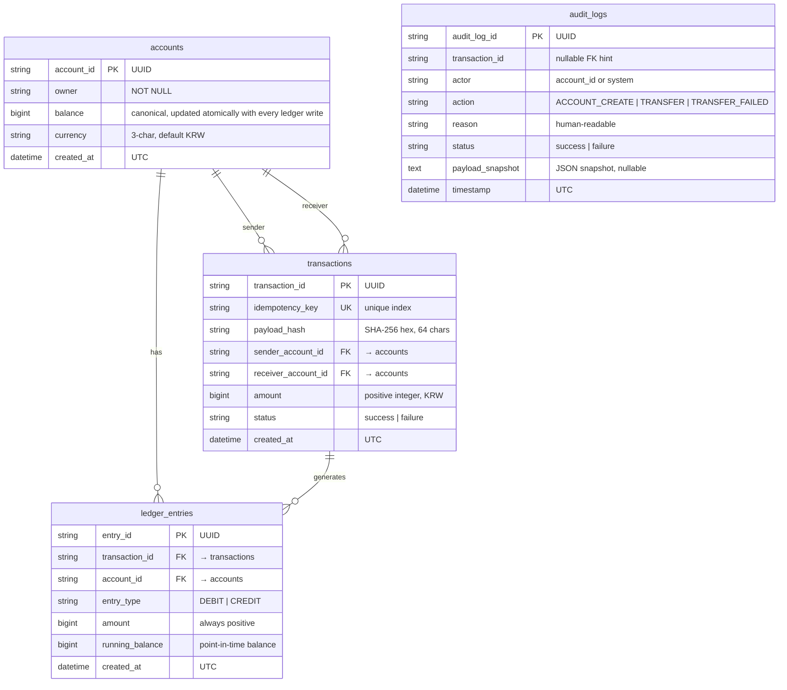

# ERD — Mock Financial Service

계정계 (core-banking) + 정보계 (analytics) 전체 스키마 다이어그램.

## 엔티티 관계 다이어그램



## 뷰 (View)

정보계 직접-DB 읽기 경로로 2개 뷰 제공 (모두 SELECT 전용, idempotent `CREATE VIEW IF NOT EXISTS`).

### `v_infobank_account_balances` — 실시간 계좌별 집계

```sql
CREATE VIEW v_infobank_account_balances AS
SELECT
    a.account_id,
    a.owner,
    a.currency,
    a.created_at,
    COALESCE(SUM(CASE WHEN le.entry_type = 'CREDIT' THEN le.amount ELSE 0 END), 0)
      - COALESCE(SUM(CASE WHEN le.entry_type = 'DEBIT'  THEN le.amount ELSE 0 END), 0)
      AS balance,
    COALESCE(SUM(CASE WHEN le.entry_type = 'CREDIT' THEN le.amount ELSE 0 END), 0) AS sum_credit,
    COALESCE(SUM(CASE WHEN le.entry_type = 'DEBIT'  THEN le.amount ELSE 0 END), 0) AS sum_debit,
    COUNT(le.entry_id) AS entry_count
FROM accounts a
LEFT JOIN ledger_entries le ON le.account_id = a.account_id
GROUP BY a.account_id, a.owner, a.currency, a.created_at;
```

### `v_infobank_ledger_entries` — 원장 항목 (계좌 메타데이터 조인)

`ledger_entries` 를 `accounts.owner`/`currency` 와 조인한 비정규화 뷰. 컬럼: `entry_id, account_id, owner, currency, transaction_id, entry_type, amount, running_balance, created_at`.

**설계 원칙**: 뷰는 SELECT 전용. `v_infobank_account_balances` 의 `balance`는 원장에서 즉시 집계한 값이며, `accounts.balance` (원장 기록과 같은 트랜잭션에서 원자적으로 갱신되는 저장 컬럼)와 항상 동일해야 함 — 다르면 버그.

## 엔티티 설명

| 엔티티 | 역할 | 계층 |
|--------|------|------|
| `accounts` | 계좌 메타데이터 + canonical `balance` 컬럼 | 계정계 |
| `transactions` | 송금 이벤트 헤더 + Idempotency-Key | 계정계 |
| `ledger_entries` | 이중기입 차변/대변 원장 | 계정계 |
| `audit_logs` | append-only 감사 로그 (DB 트리거 불변) | 계정계 |
| `v_infobank_account_balances` | 읽기 전용 뷰, 실시간 집계 (정보계 직접-DB 읽기) | 정보계 뷰 |
| `v_infobank_ledger_entries` | 읽기 전용 뷰, 원장 항목 조인 | 정보계 뷰 |
